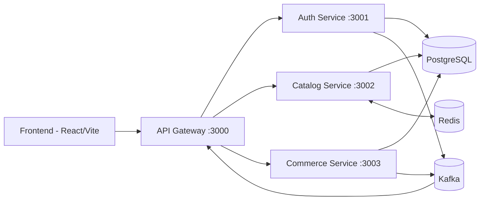

# CNWeb – Sàn Thương mại điện tử Mini (Microservices)

Đồ án xây dựng **sàn thương mại điện tử mini** hỗ trợ nhiều shop, theo kiến trúc **microservice**. Hệ thống hỗ trợ 3 nhóm người dùng (Customer, Seller, Admin), quản lý shop/sản phẩm, giỏ hàng, đơn hàng, thanh toán (COD/VNPay), đánh giá sản phẩm và thông báo realtime qua Kafka.

## Mục lục

- [Tổng quan kiến trúc](#tổng-quan-kiến-trúc)
- [Công nghệ sử dụng](#công-nghệ-sử-dụng)
- [Cấu trúc repo](#cấu-trúc-repo)
- [Yêu cầu hệ thống](#yêu-cầu-hệ-thống)
- [Cài đặt & chạy dự án](#cài-đặt--chạy-dự-án)
  - [Cách 1: Chạy bằng Docker Compose (khuyến nghị)](#cách-1-chạy-bằng-docker-compose-khuyến-nghị)
  - [Cách 2: Chạy thủ công (local dev)](#cách-2-chạy-thủ-công-local-dev)
- [Biến môi trường](#biến-môi-trường)
- [Danh sách service & port](#danh-sách-service--port)
- [Tài liệu tham khảo](#tài-liệu-tham-khảo)
- [Quy tắc commit](#quy-tắc-commit)

## Tổng quan kiến trúc

Hệ thống gồm 4 service backend (đứng sau một API Gateway chung) và 1 frontend SPA:



- **API Gateway**: cổng vào duy nhất cho frontend, định tuyến request tới các service, đồng thời consume các Kafka topic (`user.registered`, `order.created`, `order.status.updated`, `payment.succeeded`, `payment.failed`) để tạo **notification** cho người dùng.
- **Auth Service**: đăng ký, đăng nhập, refresh/revoke token, phân quyền `CUSTOMER` / `SELLER` / `ADMIN`.
- **Catalog Service**: quản lý shop, category, product (CRUD, tìm kiếm, lọc, cache Redis).
- **Commerce Service**: giỏ hàng, checkout, đơn hàng, thanh toán (COD/VNPay), đánh giá sản phẩm, thống kê doanh thu.
- **PostgreSQL**: mỗi service sở hữu riêng các bảng dữ liệu của mình, có thể dùng chung 1 PostgreSQL server với schema/role tách biệt.
- **Redis**: cache cho các API đọc nhiều (danh sách/chi tiết sản phẩm, category), theo cơ chế *fail-open* — Redis lỗi thì API vẫn đọc thẳng database.
- **Kafka**: xử lý bất đồng bộ giữa các service, chủ yếu phục vụ luồng thông báo (notification).

> Chi tiết đầy đủ về thiết kế, bảng dữ liệu, luồng nghiệp vụ: xem [`backend/system-architecture.md`](backend/system-architecture.md).

## Công nghệ sử dụng

### Backend

| Thành phần | Công nghệ |
| --- | --- |
| Ngôn ngữ | TypeScript / Node.js |
| Web framework | Express 5 |
| ORM | Prisma 7 + `@prisma/adapter-pg` |
| Database | PostgreSQL 16 |
| Cache | Redis 7 |
| Message broker | Kafka (Confluent images, kèm Zookeeper) |
| Auth | JWT (access + refresh token), `bcryptjs` |
| Upload ảnh | Cloudinary |
| Thanh toán | VNPay (sandbox) |
| API docs | Swagger UI (`swagger-ui-express`) |
| Dev tooling | `ts-node-dev`, Docker, Dockerfile theo từng service |

### Frontend

| Thành phần | Công nghệ |
| --- | --- |
| Framework | React 19 + Vite |
| Routing | React Router v7 |
| State management | Zustand |
| HTTP client | Axios (interceptor tự đính kèm token, tự refresh) |
| UI / style | TailwindCSS, Lucide React (icon) |
| Biểu đồ | Recharts |
| Thông báo UI | React Hot Toast |
| Đa ngôn ngữ | i18next / react-i18next |

## Cấu trúc repo

```txt
e-commerce/
├── backend/
│   ├── api_gateway/        # Cổng vào chung, route + consume Kafka cho notification
│   ├── auth_service/       # Đăng ký / đăng nhập / phân quyền
│   ├── catalog_service/    # Shop, category, product (+ Redis cache)
│   ├── commerce_service/   # Cart, order, payment, review, revenue
│   ├── shared/              # Script tiện ích dùng chung (db-url, startup-checks)
│   ├── docker-compose.yml  # Postgres, Redis, Kafka/Zookeeper + 4 service
│   ├── start-backend.cmd   # Script chạy song song 4 service (Windows)
│   ├── system-architecture.md  # Tài liệu thiết kế kiến trúc backend chi tiết
│   ├── api-inventory.md    # Danh mục toàn bộ API theo từng vai trò
│   └── README.md           # Hướng dẫn chi tiết cho backend (Prisma, v.v.)
├── frontend/
│   ├── src/
│   │   ├── components/     # UI component tái sử dụng (theo từng vai trò)
│   │   ├── layouts/        # Layout bọc ngoài theo từng flow (Customer/Seller/Admin)
│   │   ├── pages/          # Trang giao diện: admin, auth, customer, seller, notifications
│   │   ├── services/       # Hàm gọi API (Axios)
│   │   ├── store/          # Zustand store (auth, cart, ...)
│   │   ├── utils/          # Hàm hỗ trợ, cấu hình Axios
│   │   └── i18n.js         # Cấu hình đa ngôn ngữ
│   ├── frontend-architecture.md  # Tài liệu thiết kế kiến trúc frontend
│   └── README.md           # Hướng dẫn chi tiết cho frontend (Vite, env, ...)
└── README.md                # (file này) Tổng quan toàn dự án
```

Mỗi service backend đều theo cấu trúc MVC chung:

```txt
src/
  controllers/
  routes/
  middlewares/
  services/
  utils/
  config/
prisma/
  schema.prisma
  migrations/
  seed.js
```

## Yêu cầu hệ thống

- Node.js 20+ và npm
- Docker & Docker Compose (nếu chạy theo Cách 1)
- Hoặc nếu chạy thủ công: PostgreSQL 16, Redis 7, Kafka (kèm Zookeeper) cài sẵn / chạy local

## Cài đặt & chạy dự án

### Cách 1: Chạy bằng Docker Compose (khuyến nghị)

Cách này khởi động toàn bộ hạ tầng (PostgreSQL, Redis, Kafka, Zookeeper) và 4 service backend chỉ với một lệnh.

```bash
cd backend
docker compose up --build
```

Mỗi service cần có file `.env` riêng trong thư mục của nó (`auth_service/.env`, `catalog_service/.env`, `commerce_service/.env`, `api_gateway/.env`) — xem mục [Biến môi trường](#biến-môi-trường). Copy từ `.env.example` ở thư mục `backend` và chỉnh `DATABASE_URL`, `PORT`, `DB_SCHEMA` cho phù hợp từng service.

Sau khi container chạy xong, API Gateway sẽ sẵn sàng tại `http://localhost:3000`.

Tiếp theo, chạy frontend (frontend **không** được đóng gói trong `docker-compose.yml`):

```bash
cd frontend
npm install
cp .env.example .env
npm run dev
```

Frontend chạy tại `http://localhost:5173`.

### Cách 2: Chạy thủ công (local dev)

#### Bước 1 — Cài hạ tầng (PostgreSQL, Redis, Kafka)

Nếu không dùng Docker, cần tự cài và chạy PostgreSQL 16, Redis 7, Kafka + Zookeeper ở local, đảm bảo các port mặc định: `5432` (Postgres), `6379` (Redis), `9092` (Kafka).

> Mẹo: vẫn có thể dùng Docker Compose chỉ cho hạ tầng rồi chạy service bằng `npm run dev` ở local — chỉ cần comment phần service trong `docker-compose.yml` hoặc dùng `docker compose up db redis zookeeper kafka`.

#### Bước 2 — Cài đặt backend

```bash
cd backend
```

Tạo file `.env` cho từng service (copy từ `.env.example` ở thư mục `backend`), điền `DATABASE_URL`, `PORT`, `DB_SCHEMA` riêng cho từng service. Sau đó, trong **từng** thư mục service (`auth_service`, `catalog_service`, `commerce_service`, `api_gateway`):

```bash
cd auth_service        # lặp lại cho catalog_service, commerce_service, api_gateway
npm install
npx prisma generate
npx prisma migrate deploy   # hoặc: npx prisma migrate dev (nếu đang phát triển schema mới)
npm run dev
```

Để chạy song song cả 4 service cùng lúc, có thể dùng script có sẵn (Windows):

```bash
cd backend
npm run dev
```

Lệnh trên gọi `start-backend.cmd`, mở 4 cửa sổ terminal chạy song song `api_gateway`, `auth_service`, `catalog_service`, `commerce_service`. Trên macOS/Linux, mở 4 terminal riêng và chạy `npm run dev` trong từng thư mục service, hoặc viết script tương đương (`concurrently`, `tmux`, …).

#### Bước 3 — Cài đặt frontend

```bash
cd frontend
npm install
cp .env.example .env
npm run dev
```

Frontend chạy tại `http://localhost:5173`, gọi API qua `VITE_API_BASE_URL` (mặc định `http://localhost:3000/api`).

## Biến môi trường

### Backend

File `.env.example` ở thư mục `backend` chứa các biến môi trường dùng chung cho mọi service: `DATABASE_URL`, `JWT_*`, các `*_SERVICE_URL`, cấu hình CORS, Redis (`REDIS_URL`, `CACHE_ENABLED`, các `*_TTL_SECONDS`), Kafka (`KAFKA_BROKERS`, …), Cloudinary (`CLOUDINARY_URL`) và VNPay (`VNP_*`).

Mỗi service cần thêm tối thiểu:

```bash
PORT=3001            # port riêng của service
DB_SCHEMA="auth_service"   # schema Postgres riêng cho service
```

| Service | Port mặc định | `.env` cần đặt thêm |
| --- | --- | --- |
| `api_gateway` | `3000` | `AUTH_SERVICE_URL`, `CATALOG_SERVICE_URL`, `COMMERCE_SERVICE_URL`, `KAFKA_BROKERS` |
| `auth_service` | `3001` | `JWT_ACCESS_SECRET`, `JWT_REFRESH_SECRET`, `KAFKA_BROKERS` |
| `catalog_service` | `3002` | `REDIS_URL`, `CACHE_ENABLED`, `CACHE_*_TTL_SECONDS` |
| `commerce_service` | `3003` | `CATALOG_SERVICE_URL`, `VNP_*`, `KAFKA_BROKERS`, `REDIS_URL` |

> Xem chi tiết từng biến và hướng dẫn cấu hình Prisma trong [`backend/README.md`](backend/README.md).

### Frontend

File `frontend/.env.example`:

```bash
VITE_API_BASE_URL=http://localhost:3000/api
VITE_BACKEND_SERVICE_URLS=http://localhost:3000,http://localhost:3001,http://localhost:3002,http://localhost:3003
```

Biến môi trường Vite **bắt buộc** có tiền tố `VITE_` và truy cập bằng `import.meta.env.VITE_*`.

## Danh sách service & port

| Service | Thư mục | Port | Vai trò |
| --- | --- | --- | --- |
| API Gateway | `backend/api_gateway` | `3000` | Cổng vào chung, route request, consume Kafka cho notification |
| Auth Service | `backend/auth_service` | `3001` | Đăng ký, đăng nhập, refresh token, phân quyền |
| Catalog Service | `backend/catalog_service` | `3002` | Shop, category, product, cache Redis |
| Commerce Service | `backend/commerce_service` | `3003` | Cart, order, payment, review, revenue |
| Frontend | `frontend` | `5173` | Giao diện Customer / Seller / Admin |
| PostgreSQL | — | `5432` | Database dùng chung, tách theo schema mỗi service |
| Redis | — | `6379` | Cache cho Catalog/Commerce |
| Kafka | — | `9092` | Message broker cho event bất đồng bộ |

Mỗi service backend đều có 2 endpoint kiểm tra cơ bản:

- `GET /` — kiểm tra service đang chạy
- `GET /health` — health check

## Tài liệu tham khảo

| Tài liệu | Nội dung |
| --- | --- |
| [`backend/system-architecture.md`](backend/system-architecture.md) | Thiết kế kiến trúc backend đầy đủ: phân chia service, bảng dữ liệu, luồng nghiệp vụ, thiết kế cache/event |
| [`backend/api-inventory.md`](backend/api-inventory.md) | Danh mục toàn bộ API, phân theo Public / Customer / Seller / Admin / Internal, kèm enum chuẩn |
| [`backend/README.md`](backend/README.md) | Hướng dẫn chi tiết Prisma 7 (schema, migration, seed) cho backend |
| [`frontend/frontend-architecture.md`](frontend/frontend-architecture.md) | Thiết kế kiến trúc frontend: công nghệ, luồng routing, state management |
| [`frontend/README.md`](frontend/README.md) | Hướng dẫn chi tiết cấu trúc thư mục, Vite/React, Axios, Zustand cho frontend |
| README riêng từng service (`backend/*/README.md`) | Thông tin cấu hình, biến môi trường, cách chạy riêng từng service |

Khi backend đang chạy, có thể xem Swagger UI của từng service tại đường dẫn docs tương ứng (ví dụ: `http://localhost:3001/docs` cho Auth Service — kiểm tra route chính xác trong code/README từng service nếu khác).

## Quy tắc commit

Dự án dùng quy ước commit dạng:

```txt
type(scope): short description
```

Ví dụ:

```txt
feat(auth): add login endpoint
fix(catalog): fix product slug validation
chore(backend): configure prisma and initialize schemas
docs(readme): update setup guide
refactor(commerce): split order service logic
```

### Các type nên dùng

- `feat`: thêm tính năng mới
- `fix`: sửa lỗi
- `chore`: cấu hình, dependency, migration, setup
- `docs`: thay đổi tài liệu
- `refactor`: chỉnh cấu trúc code nhưng không đổi behavior chính
- `test`: thêm hoặc sửa test

### Quy tắc viết commit

- Một commit nên tập trung vào một mục đích chính.
- Không gộp nhiều việc không liên quan vào cùng một commit.
- Message viết bằng tiếng Anh để thống nhất lịch sử git.
- Dùng động từ ngắn, rõ nghĩa: `add`, `fix`, `update`, `remove`, `refactor`.
- Nếu thay đổi lớn ở backend hoặc DB, mô tả scope rõ: `auth`, `catalog`, `commerce`, `backend`, `frontend`.

### Gợi ý chia commit cho team

- `feat(auth): add register api`
- `feat(catalog): add category schema`
- `feat(commerce): add order migration`
- `chore(backend): update postgres env config`
- `docs(architecture): update backend architecture document`