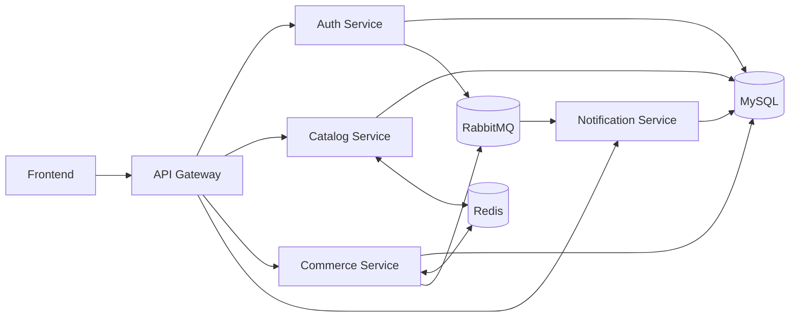

# THIẾT KẾ HỆ THỐNG BACKEND THEO KIẾN TRÚC MICROSERVICE

> **Đề tài:** Sàn thương mại điện tử mini hỗ trợ nhiều shop, giỏ hàng và thanh toán trực tuyến

## Tóm tắt nhanh

| Hạng mục | Nội dung |
| --- | --- |
| Kiến trúc | Microservice |
| Số service chính | 5 |
| Database | MySQL dùng chung theo quyền sở hữu dữ liệu của từng service |
| Cache | Redis |
| Message broker | RabbitMQ |
| Quy mô triển khai | Nhóm 4 người trong 8 tuần |

## 1. Tổng quan hệ thống

### 1.1. Mục tiêu thiết kế

Hệ thống backend được thiết kế theo kiến trúc microservice nhằm đạt các mục tiêu sau:

- Tách hệ thống thành các service theo đúng domain nghiệp vụ.
- Dễ mở rộng, dễ bảo trì hơn so với một backend monolithic.
- Phù hợp với đặc thù của sàn thương mại điện tử có nhiều role và nhiều luồng xử lý khác nhau.
- Tận dụng Redis để tối ưu các truy vấn đọc nhiều.
- Tận dụng RabbitMQ để xử lý các tác vụ bất đồng bộ.
- Giữ phạm vi vừa sức với nhóm 4 người trong 8 tuần.

### 1.2. Định hướng chia service

Hệ thống được chia theo các domain chính:

- Xác thực và quản lý tài khoản.
- Quản lý shop.
- Quản lý sản phẩm và danh mục.
- Quản lý giỏ hàng.
- Quản lý đơn hàng.
- Quản lý thanh toán.
- Quản lý thông báo.

## 2. Phân tích lý do chọn kiến trúc microservice

### 2.1. Vì sao đề tài này phù hợp với microservice

Đề tài sàn thương mại điện tử mini phù hợp với kiến trúc microservice vì:

- Có nhiều domain độc lập: user, shop, product, cart, order, payment.
- Các domain có thể phát triển, kiểm thử và bảo trì tương đối độc lập.
- Có nhiều luồng liên service, ví dụ checkout liên quan đến cart, product, order, payment.
- Có các tác vụ phụ trợ phù hợp xử lý bất đồng bộ như gửi notification, cập nhật trạng thái thanh toán.
- Dữ liệu đọc nhiều như danh sách sản phẩm, chi tiết sản phẩm rất phù hợp để cache bằng Redis.

### 2.2. Ưu điểm so với kiến trúc backend thông thường

| Tiêu chí | Monolithic | Microservice |
| --- | --- | --- |
| Tổ chức hệ thống | Một backend lớn | Nhiều service nhỏ theo domain |
| Khả năng mở rộng | Khó scale từng phần | Có thể scale từng service |
| Bảo trì | Dễ bị phụ thuộc chặt | Dễ tách trách nhiệm |
| Tích hợp async | Thường dồn vào một app | Dễ phối hợp với message broker |
| Phù hợp với e-commerce | Có thể làm được | Hợp lý hơn do nhiều nghiệp vụ độc lập |

## 3. Phạm vi kiến trúc đề xuất

### 3.1. Danh sách service

Để phù hợp với phạm vi bài tập lớn, giảm độ phức tạp triển khai nhưng vẫn giữ được tư duy microservice, hệ thống backend được thiết kế gồm 5 service chính như sau:

| STT | Service | Vai trò chính |
| --- | --- | --- |
| 1 | API Gateway | Cổng vào chung cho toàn bộ hệ thống |
| 2 | Auth Service | Xác thực, phân quyền, quản lý tài khoản |
| 3 | Catalog Service | Quản lý shop, danh mục và sản phẩm |
| 4 | Commerce Service | Quản lý giỏ hàng, đơn hàng và thanh toán |
| 5 | Notification Service | Xử lý thông báo và tác vụ bất đồng bộ |

### 3.2. Lý do gộp service

Để phù hợp với nhóm 4 người và thời gian 8 tuần, một số service được gộp lại theo domain gần nhau:

| Nhóm gộp | Lý do |
| --- | --- |
| Shop Service + Product Service -> Catalog Service | Shop và product có quan hệ chặt chẽ, seller tạo shop rồi quản lý sản phẩm thuộc shop đó. |
| Cart Service + Order Service + Payment Service -> Commerce Service | Cart, checkout, order và payment thuộc cùng luồng mua hàng, gộp lại giúp giảm giao tiếp chéo giữa các service. |
| Notification Service giữ riêng | Phù hợp để xử lý bất đồng bộ qua RabbitMQ, dễ minh họa ưu điểm microservice. |

### 3.3. Sơ đồ kiến trúc tổng quát

> **Ghi chú:** Để đơn giản khi triển khai, có thể dùng một MySQL server chung, nhưng mỗi service chỉ sở hữu và thao tác trên dữ liệu của chính nó.

## 4. Mô tả chức năng của từng service

### 4.1. API Gateway

**Vai trò:** API Gateway là điểm truy cập duy nhất của frontend vào hệ thống backend.

#### Chức năng

| Chức năng | Mô tả |
| --- | --- |
| Route request | Chuyển tiếp request đến service phù hợp |
| Auth middleware | Kiểm tra access token sơ bộ |
| Chuẩn hóa API | Tạo một điểm truy cập thống nhất cho frontend |
| Logging | Ghi log request cơ bản |
| Rate limit | Có thể bổ sung nếu cần |

#### Định tuyến chính

| Route | Chuyển đến service |
| --- | --- |
| `/api/auth/*` | Auth Service |
| `/api/catalog/*` | Catalog Service |
| `/api/commerce/*` | Commerce Service |
| `/api/notifications/*` | Notification Service |

### 4.2. Auth Service

**Vai trò:** Auth Service quản lý tài khoản, đăng nhập và phân quyền người dùng trong hệ thống.

#### Chức năng

| Chức năng | Mô tả |
| --- | --- |
| Đăng ký | Tạo tài khoản customer hoặc seller |
| Đăng nhập | Xác thực người dùng |
| Refresh token | Cấp lại access token |
| Logout | Thu hồi refresh token |
| Lấy thông tin user hiện tại | Trả về thông tin tài khoản đang đăng nhập |
| Phân quyền | Hỗ trợ role `CUSTOMER`, `SELLER`, `ADMIN` |

#### Bảng dữ liệu quản lý

##### Bảng `users`

| Trường | Kiểu dữ liệu gợi ý | Ý nghĩa |
| --- | --- | --- |
| `id` | `bigint` | ID người dùng |
| `email` | `varchar` | Email đăng nhập |
| `password_hash` | `varchar` | Mật khẩu đã băm |
| `full_name` | `varchar` | Họ tên |
| `role` | `enum` | `CUSTOMER` / `SELLER` / `ADMIN` |
| `status` | `enum` | `ACTIVE` / `INACTIVE` / `BLOCKED` |
| `created_at` | `datetime` | Thời gian tạo |
| `updated_at` | `datetime` | Thời gian cập nhật |

##### Bảng `refresh_tokens`

| Trường | Kiểu dữ liệu gợi ý | Ý nghĩa |
| --- | --- | --- |
| `id` | `bigint` | ID token |
| `user_id` | `bigint` | Người dùng sở hữu token |
| `token_hash` | `varchar` | Giá trị băm của refresh token |
| `expires_at` | `datetime` | Thời gian hết hạn |
| `revoked_at` | `datetime, nullable` | Thời gian thu hồi |
| `created_at` | `datetime` | Thời gian tạo |

#### API chính

| Method | Endpoint | Mô tả |
| --- | --- | --- |
| `POST` | `/register` | Đăng ký tài khoản |
| `POST` | `/login` | Đăng nhập |
| `POST` | `/refresh` | Refresh access token |
| `POST` | `/logout` | Đăng xuất |
| `GET` | `/me` | Lấy thông tin user hiện tại |

### 4.3. Catalog Service

**Vai trò:** Catalog Service quản lý toàn bộ phần dữ liệu "trưng bày" của sàn thương mại điện tử, bao gồm shop, category và product.

#### Chức năng tổng quát

| Nhóm chức năng | Mô tả |
| --- | --- |
| Quản lý shop | Seller tạo và cập nhật shop của mình |
| Quản lý category | Admin tạo, sửa, xóa danh mục |
| Quản lý product | Seller CRUD sản phẩm của shop mình |
| Hiển thị catalog | Customer xem shop, xem sản phẩm, tìm kiếm, lọc, sắp xếp |
| Quản trị hệ thống | Admin quản lý toàn bộ shop và sản phẩm |

#### 4.3.1. Quản lý shop

##### Chức năng

| Chức năng | Mô tả |
| --- | --- |
| Tạo shop | Seller tạo shop của mình |
| Xem shop của tôi | Seller xem shop do mình quản lý |
| Cập nhật shop | Seller sửa thông tin shop |
| Danh sách shop | Customer xem danh sách shop |
| Chi tiết shop | Customer xem thông tin chi tiết shop |
| Quản lý shop toàn hệ thống | Admin xem và quản lý toàn bộ shop |

##### Ràng buộc nghiệp vụ

| Ràng buộc | Mô tả |
| --- | --- |
| Mỗi seller chỉ có 1 shop | Một seller không được tạo nhiều shop |
| Mỗi shop thuộc về 1 seller | Quan hệ 1-1 giữa seller và shop |

##### Bảng `shops`

| Trường | Kiểu dữ liệu gợi ý | Ý nghĩa |
| --- | --- | --- |
| `id` | `bigint` | ID shop |
| `seller_id` | `bigint` | Chủ shop |
| `name` | `varchar` | Tên shop |
| `slug` | `varchar` | Định danh thân thiện |
| `logo_url` | `varchar` | Logo shop |
| `description` | `text` | Mô tả shop |
| `address` | `varchar` | Địa chỉ shop |
| `status` | `enum` | `ACTIVE` / `INACTIVE` / `PENDING` |
| `created_at` | `datetime` | Thời gian tạo |
| `updated_at` | `datetime` | Thời gian cập nhật |

#### 4.3.2. Quản lý category

##### Bảng `categories`

| Trường | Kiểu dữ liệu gợi ý | Ý nghĩa |
| --- | --- | --- |
| `id` | `bigint` | ID danh mục |
| `name` | `varchar` | Tên danh mục |
| `slug` | `varchar` | Định danh thân thiện |
| `status` | `enum` | `ACTIVE` / `INACTIVE` |
| `created_at` | `datetime` | Thời gian tạo |
| `updated_at` | `datetime` | Thời gian cập nhật |

#### 4.3.3. Quản lý product

##### Chức năng

| Chức năng | Mô tả |
| --- | --- |
| Tạo sản phẩm | Seller đăng sản phẩm |
| Cập nhật sản phẩm | Seller sửa sản phẩm |
| Xóa sản phẩm | Seller xóa sản phẩm |
| Cập nhật tồn kho cơ bản | Seller thay đổi stock |
| Danh sách sản phẩm | Customer xem product list |
| Chi tiết sản phẩm | Customer xem product detail |
| Tìm kiếm / lọc / sắp xếp | Customer tìm sản phẩm theo nhu cầu |
| Quản lý sản phẩm toàn hệ thống | Admin quản lý toàn bộ sản phẩm |

##### Bảng `products`

| Trường | Kiểu dữ liệu gợi ý | Ý nghĩa |
| --- | --- | --- |
| `id` | `bigint` | ID sản phẩm |
| `shop_id` | `bigint` | Shop sở hữu sản phẩm |
| `category_id` | `bigint` | Danh mục |
| `name` | `varchar` | Tên sản phẩm |
| `slug` | `varchar` | Định danh thân thiện |
| `description` | `text` | Mô tả |
| `price` | `decimal` | Giá |
| `stock_quantity` | `int` | Tồn kho |
| `thumbnail_url` | `varchar` | Ảnh đại diện |
| `status` | `enum` | `ACTIVE` / `INACTIVE` / `OUT_OF_STOCK` |
| `created_at` | `datetime` | Thời gian tạo |
| `updated_at` | `datetime` | Thời gian cập nhật |

##### Bảng `product_images`

| Trường | Kiểu dữ liệu gợi ý | Ý nghĩa |
| --- | --- | --- |
| `id` | `bigint` | ID ảnh |
| `product_id` | `bigint` | Sản phẩm |
| `image_url` | `varchar` | URL ảnh |
| `sort_order` | `int` | Thứ tự hiển thị |

#### API chính của Catalog Service

| Method | Endpoint | Mô tả |
| --- | --- | --- |
| `POST` | `/shops` | Seller tạo shop |
| `GET` | `/shops` | Danh sách shop |
| `GET` | `/shops/:id` | Chi tiết shop |
| `GET` | `/shops/my-shop` | Shop của seller hiện tại |
| `PUT` | `/shops/my-shop` | Cập nhật shop |
| `GET` | `/categories` | Danh sách category |
| `POST` | `/categories` | Admin tạo category |
| `PUT` | `/categories/:id` | Admin cập nhật category |
| `DELETE` | `/categories/:id` | Admin xóa category |
| `GET` | `/products` | Danh sách sản phẩm |
| `GET` | `/products/:id` | Chi tiết sản phẩm |
| `POST` | `/products` | Seller tạo sản phẩm |
| `PUT` | `/products/:id` | Seller cập nhật sản phẩm |
| `DELETE` | `/products/:id` | Seller xóa sản phẩm |
| `PATCH` | `/products/:id/stock` | Cập nhật tồn kho |

### 4.4. Commerce Service

**Vai trò:** Commerce Service là service trung tâm của luồng mua hàng, quản lý giỏ hàng, đơn hàng và thanh toán.

#### Chức năng tổng quát

| Nhóm chức năng | Mô tả |
| --- | --- |
| Cart | Thêm, sửa, xóa sản phẩm trong giỏ hàng |
| Checkout | Xử lý checkout theo từng shop |
| Order | Tạo đơn, xem lịch sử đơn, cập nhật trạng thái đơn |
| Payment | Xử lý COD và VNPay |
| Revenue / Statistics | Thống kê doanh thu cơ bản cho seller/admin |

#### 4.4.1. Quản lý giỏ hàng

##### Chức năng

| Chức năng | Mô tả |
| --- | --- |
| Xem giỏ hàng | Customer xem toàn bộ giỏ hàng |
| Thêm vào giỏ | Thêm sản phẩm |
| Cập nhật số lượng | Sửa quantity |
| Xóa item | Xóa sản phẩm khỏi giỏ |
| Checkout preview | Xem trước đơn hàng theo từng shop |

##### Ràng buộc nghiệp vụ

| Ràng buộc | Mô tả |
| --- | --- |
| Giỏ hàng có thể chứa sản phẩm từ nhiều shop | Giữ bản chất sàn thương mại điện tử |
| Mỗi lần checkout chỉ checkout 1 shop | Giảm độ phức tạp multi-vendor checkout |

##### Bảng `carts`

| Trường | Kiểu dữ liệu gợi ý | Ý nghĩa |
| --- | --- | --- |
| `id` | `bigint` | ID giỏ hàng |
| `customer_id` | `bigint` | Chủ giỏ hàng |
| `created_at` | `datetime` | Thời gian tạo |
| `updated_at` | `datetime` | Thời gian cập nhật |

##### Bảng `cart_items`

| Trường | Kiểu dữ liệu gợi ý | Ý nghĩa |
| --- | --- | --- |
| `id` | `bigint` | ID item |
| `cart_id` | `bigint` | Giỏ hàng |
| `product_id` | `bigint` | Sản phẩm |
| `shop_id` | `bigint` | Shop của sản phẩm |
| `quantity` | `int` | Số lượng |
| `selected` | `boolean` | Có chọn để checkout hay không |
| `created_at` | `datetime` | Thời gian tạo |
| `updated_at` | `datetime` | Thời gian cập nhật |

#### 4.4.2. Quản lý đơn hàng

##### Chức năng

| Chức năng | Mô tả |
| --- | --- |
| Checkout | Tạo đơn hàng từ cart theo 1 shop |
| Lịch sử đơn | Customer xem đơn của mình |
| Chi tiết đơn | Customer xem thông tin chi tiết |
| Hủy đơn | Customer hủy ở trạng thái phù hợp |
| Seller xem đơn | Seller xem đơn thuộc shop mình |
| Seller cập nhật trạng thái | Seller xử lý đơn hàng |
| Admin xem toàn bộ đơn | Admin quản lý đơn hàng toàn hệ thống |

##### Ràng buộc nghiệp vụ

| Ràng buộc | Mô tả |
| --- | --- |
| Mỗi order thuộc 1 customer | Không có order chung |
| Mỗi order thuộc 1 shop | Do checkout theo từng shop |
| Order lưu snapshot sản phẩm | Tránh dữ liệu thay đổi sau khi đặt hàng |

##### Bảng `orders`

| Trường | Kiểu dữ liệu gợi ý | Ý nghĩa |
| --- | --- | --- |
| `id` | `bigint` | ID đơn hàng |
| `order_code` | `varchar` | Mã đơn hàng |
| `customer_id` | `bigint` | Người mua |
| `shop_id` | `bigint` | Shop bán |
| `total_amount` | `decimal` | Tổng tiền |
| `shipping_fee` | `decimal` | Phí ship |
| `payment_method` | `enum` | `COD` / `VNPAY` |
| `payment_status` | `enum` | `PENDING` / `PAID` / `FAILED` / `COD_PENDING` |
| `order_status` | `enum` | `PENDING` / `AWAITING_PAYMENT` / `CONFIRMED` / `PROCESSING` / `SHIPPING` / `DELIVERED` / `CANCELLED` |
| `receiver_name` | `varchar` | Tên người nhận |
| `receiver_phone` | `varchar` | Số điện thoại người nhận |
| `receiver_address` | `varchar` | Địa chỉ giao hàng |
| `note` | `text` | Ghi chú |
| `created_at` | `datetime` | Thời gian tạo |
| `updated_at` | `datetime` | Thời gian cập nhật |

##### Bảng `order_items`

| Trường | Kiểu dữ liệu gợi ý | Ý nghĩa |
| --- | --- | --- |
| `id` | `bigint` | ID item |
| `order_id` | `bigint` | Đơn hàng |
| `product_id` | `bigint` | Sản phẩm |
| `product_name_snapshot` | `varchar` | Tên sản phẩm tại lúc đặt |
| `price_snapshot` | `decimal` | Giá tại lúc đặt |
| `quantity` | `int` | Số lượng |
| `subtotal` | `decimal` | Thành tiền |

#### 4.4.3. Quản lý thanh toán

##### Chức năng

| Chức năng | Mô tả |
| --- | --- |
| COD | Hỗ trợ thanh toán khi nhận hàng |
| VNPay | Tạo URL thanh toán và xử lý callback |
| Lưu giao dịch | Lưu trạng thái thanh toán |
| Đồng bộ order | Cập nhật trạng thái đơn sau thanh toán |

##### Bảng `payments`

| Trường | Kiểu dữ liệu gợi ý | Ý nghĩa |
| --- | --- | --- |
| `id` | `bigint` | ID thanh toán |
| `order_id` | `bigint` | Đơn hàng |
| `method` | `enum` | `COD` / `VNPAY` |
| `amount` | `decimal` | Số tiền |
| `status` | `enum` | `PENDING` / `SUCCESS` / `FAILED` |
| `transaction_ref` | `varchar` | Mã giao dịch |
| `provider_response` | `text` | Dữ liệu trả về từ cổng thanh toán |
| `created_at` | `datetime` | Thời gian tạo |
| `updated_at` | `datetime` | Thời gian cập nhật |

##### Enum trạng thái khuyến nghị

| Nhóm | Giá trị |
| --- | --- |
| `payment_method` | `COD`, `VNPAY` |
| `payment_status` | `PENDING`, `PAID`, `FAILED`, `COD_PENDING` |
| `order_status` | `PENDING`, `AWAITING_PAYMENT`, `CONFIRMED`, `PROCESSING`, `SHIPPING`, `DELIVERED`, `CANCELLED` |

#### 4.4.4. Thống kê doanh thu cơ bản

##### Chức năng

| Chức năng | Mô tả |
| --- | --- |
| Doanh thu seller | Tổng doanh thu theo tháng / quý / năm |
| Tổng tiền mua của customer | Thống kê tổng chi tiêu theo tháng / quý / năm |
| Dashboard admin | Tổng user, shop, order, doanh thu |

Phần này có thể triển khai ở mức cơ bản bằng query tổng hợp trực tiếp từ bảng `orders`.

#### API chính của Commerce Service

| Method | Endpoint | Mô tả |
| --- | --- | --- |
| `GET` | `/cart` | Xem giỏ hàng |
| `POST` | `/cart/items` | Thêm item vào giỏ |
| `PATCH` | `/cart/items/:id` | Cập nhật số lượng |
| `DELETE` | `/cart/items/:id` | Xóa item khỏi giỏ |
| `POST` | `/checkout-preview` | Xem trước dữ liệu checkout |
| `POST` | `/orders/checkout` | Tạo đơn hàng |
| `GET` | `/orders/my` | Lịch sử đơn hàng của customer |
| `GET` | `/orders/:id` | Chi tiết đơn hàng |
| `PATCH` | `/orders/:id/cancel` | Hủy đơn |
| `GET` | `/seller/orders` | Seller xem đơn của shop mình |
| `PATCH` | `/seller/orders/:id/status` | Seller cập nhật trạng thái đơn |
| `POST` | `/payments/create-vnpay-url` | Tạo URL VNPay |
| `GET` | `/payments/vnpay-return` | Xử lý callback VNPay |
| `GET` | `/payments/order/:orderId` | Xem payment của đơn hàng |
| `GET` | `/seller/revenue-summary` | Doanh thu seller |
| `GET` | `/admin/dashboard-summary` | Dashboard cơ bản cho admin |

### 4.5. Notification Service

**Vai trò:** Notification Service xử lý thông báo trong hệ thống và nhận event bất đồng bộ từ RabbitMQ.

#### Chức năng

| Chức năng | Mô tả |
| --- | --- |
| Thông báo đăng ký | Gửi thông báo sau khi user đăng ký |
| Thông báo tạo đơn | Gửi cho customer và seller khi order tạo thành công |
| Thông báo thanh toán | Gửi khi thanh toán thành công / thất bại |
| Thông báo cập nhật trạng thái đơn | Gửi cho customer khi seller đổi trạng thái đơn |
| Danh sách thông báo | User xem lịch sử thông báo |

#### Bảng `notifications`

| Trường | Kiểu dữ liệu gợi ý | Ý nghĩa |
| --- | --- | --- |
| `id` | `bigint` | ID thông báo |
| `user_id` | `bigint` | Người nhận |
| `type` | `varchar` | Loại thông báo |
| `title` | `varchar` | Tiêu đề |
| `content` | `text` | Nội dung |
| `is_read` | `boolean` | Đã đọc hay chưa |
| `created_at` | `datetime` | Thời gian tạo |

#### API chính

| Method | Endpoint | Mô tả |
| --- | --- | --- |
| `GET` | `/notifications/me` | Danh sách thông báo của user |
| `PATCH` | `/notifications/:id/read` | Đánh dấu đã đọc |

#### Event RabbitMQ đề xuất

| Event | Nguồn phát | Mục đích |
| --- | --- | --- |
| `user.registered` | Auth Service | Gửi thông báo đăng ký thành công |
| `order.created` | Commerce Service | Gửi thông báo tạo đơn |
| `payment.succeeded` | Commerce Service | Gửi thông báo thanh toán thành công |
| `payment.failed` | Commerce Service | Gửi thông báo thanh toán thất bại |
| `order.status.updated` | Commerce Service | Gửi thông báo thay đổi trạng thái đơn |

## 5. Phân bổ trách nhiệm dữ liệu giữa các service

| Service | Bảng dữ liệu sở hữu |
| --- | --- |
| Auth Service | `users`, `refresh_tokens` |
| Catalog Service | `shops`, `categories`, `products`, `product_images` |
| Commerce Service | `carts`, `cart_items`, `orders`, `order_items`, `payments` |
| Notification Service | `notifications` |

Để đơn giản khi triển khai, có thể dùng 1 MySQL server chung, nhưng mỗi service chỉ thao tác với các bảng thuộc quyền sở hữu của service đó.

## 6. Thiết kế luồng nghiệp vụ chính

### 6.1. Luồng seller tạo shop và đăng sản phẩm

| Bước | Mô tả | Service tham gia |
| --- | --- | --- |
| 1 | Seller đăng ký / đăng nhập | Auth Service |
| 2 | Seller tạo shop | Catalog Service |
| 3 | Hệ thống kiểm tra seller chưa có shop | Catalog Service |
| 4 | Seller thêm sản phẩm vào shop | Catalog Service |

### 6.2. Luồng customer thêm sản phẩm vào giỏ

| Bước | Mô tả | Service tham gia |
| --- | --- | --- |
| 1 | Customer xem danh sách sản phẩm | Catalog Service |
| 2 | Customer xem chi tiết sản phẩm | Catalog Service |
| 3 | Customer thêm sản phẩm vào giỏ | Commerce Service |
| 4 | Customer chỉnh sửa / xóa item trong giỏ | Commerce Service |

### 6.3. Luồng checkout theo từng shop

| Bước | Mô tả | Service tham gia |
| --- | --- | --- |
| 1 | Customer chọn checkout cho một shop | Commerce Service |
| 2 | Lấy cart items thuộc shop đó | Commerce Service |
| 3 | Kiểm tra dữ liệu sản phẩm / tồn kho | Catalog Service + Commerce Service |
| 4 | Tạo order và `order_items` | Commerce Service |
| 5 | Nếu COD: tạo order hoàn tất bước checkout | Commerce Service |
| 6 | Nếu VNPay: tạo payment URL | Commerce Service |
| 7 | Phát event `order.created` | Commerce Service -> RabbitMQ |

### 6.4. Luồng thanh toán VNPay

| Bước | Mô tả | Service tham gia |
| --- | --- | --- |
| 1 | User được chuyển tới VNPay sandbox | Commerce Service |
| 2 | VNPay callback về hệ thống | Commerce Service |
| 3 | Verify callback | Commerce Service |
| 4 | Cập nhật payment | Commerce Service |
| 5 | Cập nhật order / payment status | Commerce Service |
| 6 | Publish `payment.succeeded` hoặc `payment.failed` | Commerce Service |
| 7 | Notification consume event và gửi thông báo | Notification Service |

### 6.5. Luồng seller cập nhật trạng thái đơn

| Bước | Mô tả | Service tham gia |
| --- | --- | --- |
| 1 | Seller xem danh sách order của shop mình | Commerce Service |
| 2 | Seller cập nhật trạng thái đơn | Commerce Service |
| 3 | Publish `order.status.updated` | Commerce Service |
| 4 | Notification gửi thông báo cho customer | Notification Service |

## 7. Thiết kế Redis caching

### 7.1. Mục đích

Redis được dùng để cache dữ liệu có tần suất đọc cao, giúp giảm tải database và tăng tốc phản hồi.

### 7.2. Dữ liệu nên cache

| Dữ liệu | Key gợi ý | Ghi chú |
| --- | --- | --- |
| Danh sách sản phẩm | `products:list:{query}` | Cache theo bộ lọc / tìm kiếm |
| Chi tiết sản phẩm | `product:detail:{id}` | Đọc nhiều |
| Danh sách category | `categories:all` | Ít thay đổi |
| Danh sách shop | `shops:list:{query}` | Có thể cache ngắn hạn |
| Doanh thu seller | `seller:{shopId}:revenue:{period}` | Nếu có thống kê lặp lại nhiều |

### 7.3. Invalidate cache

| Hành động | Cache cần xóa |
| --- | --- |
| Tạo / sửa / xóa sản phẩm | Product list, product detail |
| Đổi tồn kho | Product detail, product list liên quan |
| Tạo / sửa / xóa category | Category cache |
| Tạo / sửa shop | Shop list, shop detail |

## 8. Thiết kế RabbitMQ cho xử lý bất đồng bộ

### 8.1. Mục đích

RabbitMQ được dùng để tách các tác vụ không cần phản hồi ngay khỏi luồng chính.

### 8.2. Event chính

| Event | Nguồn phát | Service nhận |
| --- | --- | --- |
| `user.registered` | Auth Service | Notification Service |
| `order.created` | Commerce Service | Notification Service |
| `payment.succeeded` | Commerce Service | Notification Service |
| `payment.failed` | Commerce Service | Notification Service |
| `order.status.updated` | Commerce Service | Notification Service |

### 8.3. Lợi ích

| Lợi ích | Mô tả |
| --- | --- |
| Tăng tốc response | Không phải chờ gửi thông báo trong luồng chính |
| Giảm coupling | Commerce không phụ thuộc trực tiếp Notification |
| Dễ mở rộng | Sau này có thể thêm analytics / audit consumer |

## 9. Thiết kế vai trò và phân quyền

### 9.1. Các role trong hệ thống

| Role | Quyền chính |
| --- | --- |
| `CUSTOMER` | Xem sản phẩm, thêm giỏ hàng, checkout, xem đơn hàng |
| `SELLER` | Tạo shop, quản lý sản phẩm, xem và xử lý đơn của shop mình |
| `ADMIN` | Quản lý user, shop, category, product, order, dashboard |

### 9.2. Middleware phân quyền đề xuất

| Middleware | Mục đích |
| --- | --- |
| `requireAuth` | Yêu cầu đăng nhập |
| `requireRole("CUSTOMER")` | Chỉ customer truy cập |
| `requireRole("SELLER")` | Chỉ seller truy cập |
| `requireRole("ADMIN")` | Chỉ admin truy cập |

## 10. Ràng buộc nghiệp vụ cốt lõi

| Ràng buộc | Mô tả |
| --- | --- |
| Mỗi seller chỉ có 1 shop | Giảm độ phức tạp nghiệp vụ |
| Mỗi product thuộc 1 shop | Quan hệ dữ liệu rõ ràng |
| Giỏ hàng có thể chứa sản phẩm từ nhiều shop | Giữ đúng bản chất sàn TMĐT |
| Mỗi lần checkout chỉ xử lý 1 shop | Tránh multi-vendor checkout |
| Mỗi order thuộc 1 customer và 1 shop | Đơn giản hóa quản lý order |
| Hỗ trợ COD và VNPay | Phạm vi thanh toán hợp lý |
| Chưa có ví seller, đối soát, chat, voucher đa shop | Chủ động giới hạn scope |
